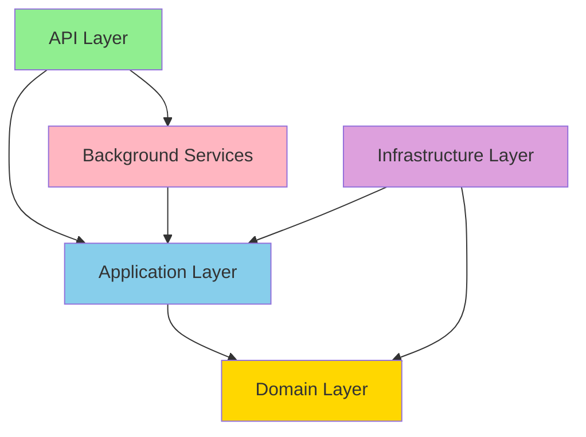

# Stock Price Monitoring System

A real-time stock price monitoring system built with .NET 8, following Clean Architecture principles and the CQRS pattern.

## 🏰️ Architecture


## 🌟 Features
- Real-time stock price monitoring
- User preference management
- Price threshold alerts
- Caching for performance optimization
- Health monitoring
- Global exception handling

## 🏦 Solution Structure
```
Kaar/
├── src/
│   ├── Domain/                 # Enterprise Business Rules
│   ├── Application/           # Application Business Rules
│   ├── Infrastructure/       # External Concerns
│   ├── BackgroundServices/  # Background Processing
│   ├── Api/                # API Layer
│   └── Main/              # Composition Root
└── tests/               # Test Projects
```

## 🔧 Technical Stack
- **.NET 8**: Latest framework version
- **Entity Framework Core**: ORM for data access
- **AutoMapper**: Object-object mapping
- **MediatR**: CQRS implementation
- **FluentValidation**: Input validation
- **Serilog**: Structured logging
- **SQL Server**: Data storage

## 🚀 Getting Started

1. **Prerequisites**
   - .NET 8 SDK
   - SQL Server
   - Visual Studio 2022 or VS Code

2. **Database Setup**
   ```bash
   dotnet ef database update
   ```

3. **Running the Application**
   ```bash
   dotnet run --project src/Main
   ```

4. **API Endpoints**
   - GET `/api/stocktracking/{symbol}` - Get latest stock price
   - PUT `/api/stocktracking` - Update stock price
   - POST `/api/preferences` - Create user preference
   - GET `/health` - Service health check

## 🏰️ Design Patterns
- Clean Architecture
- CQRS Pattern
- Repository Pattern
- Decorator Pattern
- Observer Pattern (for notifications)

## 💡 Key Components

### Domain Layer
- Core business entities
- Domain logic
- Business rules

### Application Layer
- Use case implementation
- DTOs and interfaces
- Business logic orchestration

### Infrastructure Layer
- Database operations
- External service implementations
- Caching implementation

### Background Services
- Stock price monitoring
- Alert generation
- Scheduled tasks

### API Layer
- REST endpoints
- Request/response models
- Controllers

## 📈 Monitoring
- Health checks
- Performance metrics
- Error logging
- Request/response logging

## 🔒 Security
- Input validation
- Error handling
- Data sanitization
- Rate limiting

## 🧪 Testing
- Unit tests
- Integration tests
- End-to-end tests

## 📆 Dependencies
- Microsoft.EntityFrameworkCore
- AutoMapper
- MediatR
- FluentValidation
- Serilog

## 🤝 Contributing
1. Fork the repository
2. Create a feature branch
3. Commit changes
4. Push to the branch
5. Create a Pull Request

